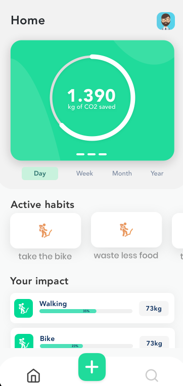
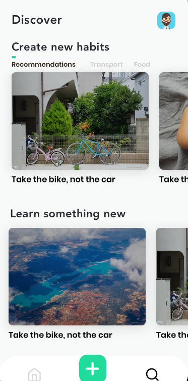
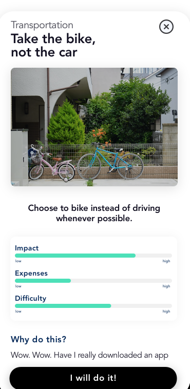
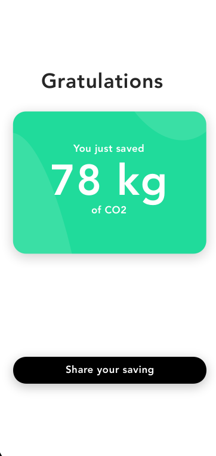

  

<h1 align="center"> Climatic </h1>  

   A open-source App to track your CO2 expenses and fight climate change

    
    
    
    

## Important Note

> This Software is currently not released and is in a very early Alpha stage and not intended to be used by the public. Once a Beta version is out this Note will disappear

## 🎁 Features 

* calculate your CO2 footprint
* track your CO2 expenses
* statistics about your Journey
* create habits to stay on track
* get tips on how to minimize your CO2 footprint

## Screenshots

	    
	     

	    
	        

